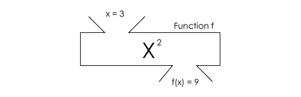

# 매개변수

매개변수를 이용하면 함수를 호출할 때 전달하고자 하는 값을 입력하여 호출할 수 있다.

```
function 함수이름(매개변수1, 매개변수2, 매개변수3){
    //함수코드
}
함수명(데이터1, 데이터2, 데이터3);
```
함수를 호출할 때 '데이터1'은 '매개변수1'에 저장되고,
'데이터2'는 '매개변수2'에 저장된다.
그리고 '데이터3'은 '매개변수3'에 저정된다.

예제1
```
function myFnc(name, area){
    document.write("안녕하세요." + name + "입니다.", "<br>");
    document.write("사는 곳은" + area + "입니다.", "<br><br>");
}
myFnc("홍당무", "서울");
myFnc("깍두기", "부산");
```


# 매개변수와 리턴값

return문은 함수에서 결과값을 반환한다.
return문이 실행되면 코드가 강제로 종료된다.

```
function 함수이름(매개변수1, 매개변수2, 매개변수3){
    //함수코드
    return 리턴값;
}
```



위 함수를 자바스크립트로 작성하면,
```
function f(x) {
    //함수코드
    return x * x;
}
//함수 호출
console.log(f(3)); //9
```